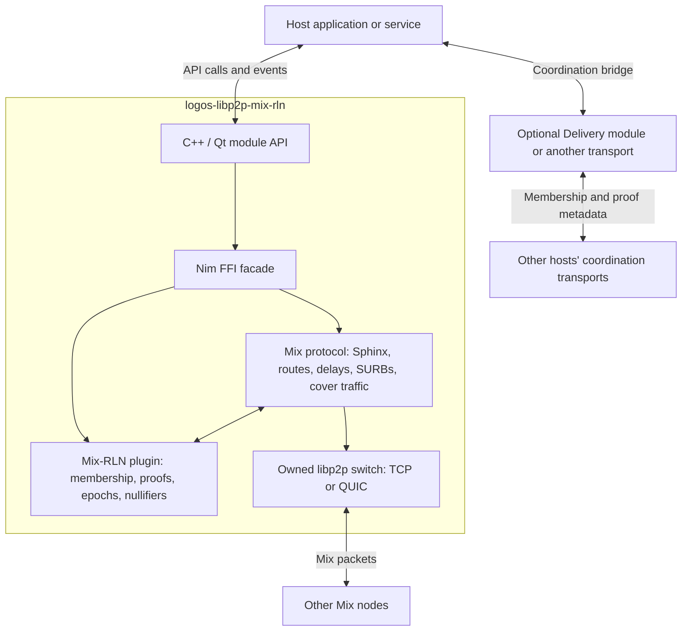
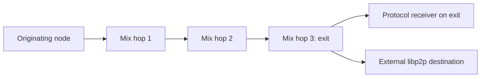
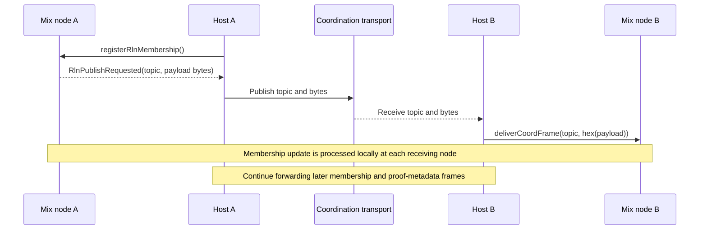
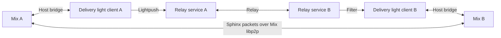

# logos-libp2p-mix-rln

Logos Core module for standalone Mix routing infrastructure: a libp2p node
running Sphinx routing with per-hop RLN rate limiting, following
[LIP LOGOS-MIXNET][lip]. Deploy it as an intermediate hop without a chat
application or a bundled Delivery node.

Mix owns its libp2p switch. RLN coordination crosses a host API boundary and
can use a separate Relay-capable Logos Delivery module. The two modules have
independent peer IDs and lifecycles; Mix peer records do not connect Delivery
peers. Proof generation and verification currently use the bundled Mix-RLN
plugin; an external RLN-module proof provider is not implemented.

Sibling module to [`logos-libp2p-module`][libp2p-module]; shares its
C++/Qt plugin shape, config-via-env convention, and nim-ffi bridge pattern.

Wraps the C FFI facade at
[`logos-co/nim-libp2p-mix-rln-ffi`][nim-facade].

## Contents

- [Architecture](#architecture)
  - [Deployment model](#deployment-model)
  - [Components and ownership](#components-and-ownership)
  - [Node roles](#node-roles)
  - [Application packet flow](#application-packet-flow)
  - [RLN and coordination](#rln-and-coordination)
  - [Coordination API contract](#coordination-api-contract)
  - [Optional Logos Delivery integration](#optional-logos-delivery-integration)
  - [Identities, topology, and lifecycle](#identities-topology-and-lifecycle)
  - [Cover traffic and rate limits](#cover-traffic-and-rate-limits)
- [Build](#build)
- [Tests](#tests)
- [Using the module](#using-the-module)
- [Public API summary](#public-api-summary)
- [Config](#config)
- [What's pending](#whats-pending)
- [Layout](#layout)

## Architecture

### Deployment model

The main use case is a node that contributes routing capacity to the Mix
network. A host loads this module, starts its libp2p node, supplies Mix peer
records, and connects RLN coordination. Once configured, the node processes
and forwards Mix packets without a chat application or a host callback for
each forwarded payload.

Here, **host** means the application or service that loads modules into
Logos Core and connects their APIs and events. It can be a headless service.

| Question | Current behavior |
| --- | --- |
| Is Logos Delivery required? | No. The host must provide coordination between participating RLN nodes, but can use Delivery or another transport that carries the same frames. |
| Is `logos-libp2p-module` required? | No. This module embeds the Nim libp2p library and creates its own switch. It does not borrow another Logos module's switch. |
| Is a separate RLN module required? | No. Proof generation and verification use the bundled Mix-RLN plugin and zerokit. |
| Is this an intermediate node? | Yes, by default. Application sending and exit delivery require separate opt-ins. |
| Is there an intermediate-only mode? | Yes. Both `mix.allowSend` and `mix.allowExit` default to `false`. |
| Does loading Delivery connect coordination automatically? | No. The host explicitly bridges the coordination APIs and events. |

### Components and ownership



There are two network flows: Mix packets travel over the switch owned by
this module; RLN coordination frames travel through the host's selected
transport. Application payloads do not pass through Delivery as part of
this module's Mix routing implementation.

| Layer | Responsibility |
| --- | --- |
| This repository | Exposes the Logos module API, loads configuration, bridges C++ calls into Nim, and turns callbacks into events and polling queues. |
| `nim-libp2p-mix-rln-ffi` | Creates and owns the switch, Mix protocol, and RLN plugin; manages their lifecycle; exposes the C ABI consumed by the module. |
| `nim-libp2p-mix` | Builds and processes Sphinx packets, selects routes, forwards packets, schedules cover traffic, and handles single-use reply blocks. |
| `mix-rln-spam-protection-plugin` | Maintains RLN membership state, generates and verifies proofs, tracks epochs and nullifiers, and produces or consumes coordination frames. |
| Nim libp2p | Provides peer identity, listening, connections, and protocol streams for the Mix node. |
| Zerokit | Provides the underlying RLN cryptographic implementation used by the plugin. |
| Host coordination bridge | Publishes outgoing coordination frames and delivers incoming frames to the correct Mix module instance. |

The FFI composes these libraries into one node; the boxes inside the module
are not separate Logos modules or separately deployed services. The module
manifest does not require a Delivery module.

### Node roles

Intermediate routing is always available. Two independent, create-time
options enable application endpoint behavior:

```json
{"mix": {"allowSend": false, "allowExit": false}}
```

| `allowSend` | `allowExit` | Application capabilities |
| --- | --- | --- |
| `false` | `false` | Intermediate only (default). |
| `true` | `false` | Originate messages and explicit SURB replies; no exit delivery. |
| `false` | `true` | Deliver exit traffic locally or to external destinations; no host-originated sends. |
| `true` | `true` | Both sender and exit capabilities. |

These switches do not disable cover traffic, intermediate forwarding, RLN
coordination, or replies arriving through a previously issued SURB.
`allowSend` gates all `sendMixMessage*` methods, including
`sendMixSurbReply`. `allowExit` gates `mountReceiver` and application exit
processing inside the Mix protocol, including forwarding to external
libp2p destinations. Protocol-generated replies to an exit request remain
part of exit handling; a host calling `sendMixSurbReply` explicitly needs
`allowSend` too. Disabled endpoint APIs return an error naming the setting
required to enable them.

| Role | What happens | Host involvement |
| --- | --- | --- |
| Sender / edge functionality | Chooses a route and originates a Sphinx message. | Calls a `sendMixMessage*` method with the destination and payload. |
| Intermediate | Processes its Sphinx layer and forwards the packet toward the next hop with RLN protection. | Supplies configuration, peers, and coordination; no application receiver is needed. |
| Exit | Processes the final Mix layer and delivers to the destination protocol. | Can deliver to an external libp2p destination or a receiver mounted on the exit itself. |

For an intermediate deployment, the host does not need to originate
application messages or call `mountReceiver`. The node still runs the full
Mix protocol, including its cover traffic behavior. The receiving node
enforces its exit policy even if a sender supplies a stale or false exit
advertisement. Returning cover loops are recognized before the application
exit restriction and are still consumed normally.

### Application packet flow

The protocol uses a three-hop Mix path. The originating application node
is shown separately from those three hops:



The exit uses one of the two delivery branches for a message.

1. The sender obtains eligible Mix peer records from its local pool and
   constructs the Sphinx route and encrypted packet.
2. The packet travels directly between Mix nodes using their libp2p
   switches. Incoming traffic is checked by the RLN spam-protection
   implementation; outgoing hop traffic uses RLN proofs. Sphinx processing
   reveals the routing information needed for the current hop.
3. The Mix protocol applies its forwarding and scheduling behavior and
   sends to the next hop. The host does not relay these packet bytes.
4. At the exit, the message is delivered to the requested application
   protocol. `sendMixMessageToExit` targets a receiver on the selected exit;
   `sendMixMessage` supplies a separate destination peer and address.

`mountReceiver` installs a local application protocol handler.
`drainReceivedMessages` returns the received application messages, including
their protocol, payload, and any reply-block bytes. These are endpoint
facilities; an intermediate does not receive the final application payload
through this inbox.

For replies, the `*WithSurb` methods attach a **single-use reply block
(SURB)**. The recipient uses `sendMixSurbReply` with that block to send a
reply through Mix without being given a direct return address. The current
request API waits for the reply with a timeout, so the recipient must be
serviced concurrently; see the [SURB example](#6-request-and-send-a-surb-reply).

### RLN and coordination

RLN protects Mix traffic with membership-based rate-limit proofs. Each node
needs its own membership credentials and a compatible view of membership
state to participate. A libp2p connection or a Mix peer record alone does
not establish that state.

The plugin uses two coordination topics by default:

| Topic | Purpose |
| --- | --- |
| `/mix/rln/membership/v1` | Distributes membership updates used to maintain the RLN group state. |
| `/mix/rln/metadata/v1` | Distributes proof metadata used for network-wide nullifier and spam tracking. |

The topics can be configured, but the host's subscriptions and all
participating nodes must agree on them. Coordination is an ongoing service,
not just a startup membership exchange: keep the bridge running while the
Mix node is active.



The same boundary is used regardless of the transport. Configure the
coordination network in the host transport module.

The current registration mechanism does not provide distributed membership
index allocation. During controlled setup, register nodes sequentially and
let each announcement reach the other nodes before registering the next.
A successful registration call confirms local work, not that every remote
node has received the update. Reliable dissemination, restart recovery,
and late-join history synchronization remain deployment work.

### Coordination API contract

There are two ways to obtain outgoing frames:

| Boundary | Representation and behavior |
| --- | --- |
| `RlnPublishRequested` event | Topic plus raw payload bytes, for an event-driven host. |
| `drainCoordBacklog()` | Returns and clears queued `{contentTopic, payloadHex}` records, for a polling host. |
| `deliverCoordFrame(contentTopic, payloadHex)` | Accepts a received frame as hex and dispatches it to the corresponding plugin handler. Unknown topics and malformed hex are rejected. |

Choose events or polling as the publication source. The module retains
frames in its backlog even when it emits events, so an event-driven host
must also drain that backlog periodically **without publishing it again**.
These in-memory queues are not a durable message broker and do not provide
transport delivery acknowledgements.

Dispatch bridge work asynchronously outside the module's callback. The
wrapper presents synchronous calls over the asynchronous Nim FFI and
serializes ordinary calls; re-entering it from its callback can block
progress. A host should queue the work, return from the callback, and then
perform cross-module calls from its own execution context.

If publishing fails, the host must observe and handle the transport error.
The plugin's publish callback emits a request; successful emission does not
mean another node received it. The host must preserve the topic and bytes
exactly and avoid confusing raw byte arrays with their hex representation.

### Optional Logos Delivery integration

With Delivery as the coordination backend, each Mix host has **two nodes**:

| Mix node | Delivery node |
| --- | --- |
| Owned by this module. | Owned by the separate Delivery module. |
| Carries Sphinx packets between Mix peers. | Carries RLN coordination frames between participating hosts. |
| Has its own libp2p identity, listeners, and peer records. | Has its own identity, listeners, subscriptions, and network configuration. |
| Starts and stops through this module's API. | Starts and stops through the Delivery module's API. |

The host subscribes Delivery to the coordination topics, forwards Mix
publication requests to Delivery's `send`, and forwards received Delivery
messages to `deliverCoordFrame`. The local Delivery node can participate in
Relay directly, or run as a light client with `relay=false`: it publishes via
Lightpush and receives subscribed topics via Filter. Light clients need
reachable service nodes providing Lightpush and Filter on a Relay network.
The Relay network is still required, but it need not run on the Mix hosts.

Delivery's light-client role is independent of Mix's sender/exit capabilities.
A Mix intermediate can use a Delivery light client without enabling either
`mix.allowSend` or `mix.allowExit`.

Starting Mix does not start Delivery, and adding a Mix peer does not add a
Delivery peer. Both nodes may be managed by the same host, but sharing a
host does not make them share a switch or an identity. The
[coordination setup example](#4-connect-coordination-and-register-rln-membership)
describes the bridge in more detail.

For a deployment without Delivery, replace that backend with a transport
that distributes the same coordination frames. The multi-node test uses a
host-managed bus for membership setup. A separate
[Delivery coordination E2E](#delivery-coordination-end-to-end) exercises the
bridge through live local Relay nodes. Neither fixture provides a production
coordination service.

### Identities, topology, and lifecycle

These identifiers serve different purposes:

| Identifier | Meaning |
| --- | --- |
| Mix node's libp2p Peer ID | Identifies the transport peer. |
| Mix public key | Curve25519 key used for Sphinx packet construction. |
| RLN membership index | Position in the RLN membership state; not a transport identity. |
| Optional Delivery Peer ID | Identifies the independently managed coordination node. |

`getLocalMixPeerRecord` exports the Mix node's peer ID, multiaddresses,
Mix public key, libp2p public key, and `exitEnabled` capability. The host
supplies other nodes' records
through `addMixPeer`; `listMixPeers` shows this local routing pool. Adding a
record does not establish RLN membership or distribute it to other nodes.
Automatic service discovery is not implemented.

Senders reserve an exit-enabled peer before selecting intermediates for an
external destination. An explicit exit destination must also advertise
`exitEnabled: true`. If no eligible exit exists, the send fails rather than
choosing an intermediate as the exit. Records without this field are treated
as intermediate-only by this module. Re-export and redistribute records
after changing a node's exit configuration.

A typical host lifecycle is:

1. Load the module. Its constructor attempts to create a node from
   `LIBP2P_MIX_RLN_MODULE_CONFIG`, or the defaults, without starting it.
2. If needed, call `createNode` with explicit configuration before starting.
   Reconfiguration replaces the node context and clears the wrapper's
   coordination and receiver queues. Stop an active node first.
3. Call `start`, which starts the RLN plugin and the owned switch. Obtain
   the local peer record after startup so dynamically allocated ports are
   resolved. Advertise addresses that other hosts can actually reach.
4. Populate routing pools and activate the host coordination bridge.
5. Register and synchronize RLN memberships before sending application
   traffic. Having a running switch alone is not routing readiness.
6. Keep coordination and any endpoint receiver processing active while
   the node routes packets.
7. Call `stop` to stop the owned switch and plugin. Stop a separate
   coordination backend through its own lifecycle API when appropriate.

`status` reports wrapper context state; it is not a network readiness
probe. A created context does not prove that listeners are active, enough
eligible route candidates exist, or remote membership state is synchronized.

### Cover traffic and rate limits

The node uses constant-rate cover scheduling with the RLN epoch and message
budget. The plugin's epoch changes drive the scheduler. The cover fraction
must be greater than zero and at most one; `getCoverTrafficRate` and
`setCoverTrafficRate` expose the current fraction and allow live updates.

Cover packets consume processing and proof-generation resources even when
the host sends no application messages. The examples use `0.01` to keep
local tests inexpensive; that value is a test setting, not a privacy or
capacity guarantee. RLN constrains protocol traffic; it does not replace
an application's authorization or business-level quotas.

## Status

Validated end-to-end through a multi-daemon test: five `logoscore` daemons
route a real Sphinx-encrypted payload from node 0 to node 4 with per-hop
RLN proofs, exit-is-dest delivery, and payload verification on the receiver.

## Build

Requires [`logos-module-builder`][builder]. The pinned FFI dependency
includes the zerokit packaging changes needed by this build:

```sh
nix build .#lgx
```

The FFI facade pins the [zerokit fork branch][zerokit-fork] that carries
PR #436 as its default `zerokit` input, so no overrides are needed. Once
those packaging changes land upstream, the pin flips back to
`vacp2p/zerokit`.

## Tests

### Unit

```sh
nix run .#tests
```

The generated unit-test target currently has a packaging issue: its output
contains an empty `bin/` directory. The five configuration tests have been
run directly with the Logos test framework runner; the command above is
not currently a substitute for that validation. The standalone and
multi-node end-to-end apps below are separate runnable targets.

### Standalone end-to-end (single daemon)

Loads the module under a live `logoscore` daemon, drives the lifecycle
(`createNode → start → getNodeInfo → stop`), asserts error handling:

```sh
nix run .#standalone-e2e
```

### Multi-node end-to-end (5 daemons, Sphinx + RLN)

Spawns N=5 independent `logoscore` daemons (each under its own `HOME`),
cross-registers peer records, syncs RLN memberships through a host coordination bus,
mounts a receiver protocol on the exit, sends a mix
message from node 0 to node 4 through the exit-is-dest path, and verifies
the payload byte-for-byte on the receiver's inbox:

```sh
nix run .#multi-node-e2e
```

Expected tail:

```
----- polling node 4 inbox for delivery -----
  inbox: proto=/logosmix/test/echo/1.0.0 payload='hello mix (through logoscore)'
PASS: N=5 mix nodes routed a payload through Sphinx + RLN via logoscore
```

The `N` environment variable changes the fleet size. The default five-node
fixture provides candidates for the fixed three-hop route. A three-hop
path does not imply that three total nodes suffice: route selection also
excludes peers according to their role in the request, and SURB replies
need eligible return-path candidates.

### Delivery coordination end-to-end

```sh
nix run .#delivery-coordination-e2e
```

Runs the same five-daemon routing scenario with a separate Delivery node in
each daemon. The tests pin Delivery module v0.2.1 solely for the E2E apps; Delivery
is not added to the Mix module's runtime dependencies.

The host bridge in `tests/integration_e2e/delivery_coordination.py`:

- Starts an isolated local Relay network and checks that each Delivery peer ID
  differs from its host's Mix peer ID.
- Subscribes to `/mix/1/membership/proto` and `/mix/1/metadata/proto`, configured
  on every Mix node as Delivery-compatible content topics.
- Waits for Relay readiness, then registers memberships sequentially. Every
  membership frame must arrive through `messageReceived` on every remote
  Delivery node before the bridge submits it to `deliverCoordFrame`.
- Keeps polling `drainCoordBacklog` during Sphinx/RLN payload routing and
  requires proof metadata to arrive through Relay too.
- Compares received coordination frames with the published frames and verifies
  the application payload at the Mix exit byte-for-byte.

For the CLI's literal-byte argument format, the fixture transports a JSON
envelope containing the frame's hex bytes and origin. The bridge decodes this
envelope before submitting the original bytes to Mix. There is no direct
host-bus fallback in this mode. The test covers controlled local Relay
coordination, not late-join synchronization, production membership allocation,
or recovery from network partitions.

When running the shell fixture directly, set `DELIVERY_LGX_DIR` to a directory
containing the Delivery `.lgx` package and have `python3` on `PATH` in addition
to the ordinary multi-node prerequisites.

### Delivery light-client coordination end-to-end

```sh
nix run .#delivery-edge-coordination-e2e
```

Runs five Mix nodes with five Delivery light clients (`relay=false`), plus
**two additional Delivery-only service daemons**. Both service nodes enable
Relay, Lightpush, and Filter and subscribe to the coordination topics. The
light clients are split between the two services, with one upstream each and
Rendezvous discovery disabled. Coordination must cross the Relay link between
the services. The clients do not form a Relay mesh with each other, and the
service nodes host no Mix module.



This variant applies the same membership, proof-metadata, identity, and
payload assertions as the Relay variant, and checks successful Lightpush
publication from every client. It keeps the existing sender-only,
intermediate-only, and exit-only Mix roles. Disabling Filter on the service
nodes prevents readiness and fails the test before membership registration.
Removing the Relay link also fails readiness: only clients on the publisher’s
service node receive the probes.

The `filter` and `lightpush` configuration flags enable **server** protocols;
they are enabled on the service nodes, not the light clients. Delivery mounts
the client protocols internally. Both roles use the same module `send`,
`subscribe`, and `messageReceived` APIs, so the host bridge is unchanged.

For a direct shell run, set `DELIVERY_MODE=edge` together with
`DELIVERY_LGX_DIR`. The default mode remains `relay`. This local fixture does
not validate service failover or recovery from network partitions.

## Using the module

The examples below use the packaged module through `lgpm` and `logoscore`.
They require `nix`, `jq`, `lgpm`, and `logoscore`.

### 1. Build, install, and load

Build the package and install the generated `.lgx` into an isolated module
directory:

~~~sh
nix build .#lgx
LGX=$(find -L result -name '*.lgx' -print -quit)
mkdir -p modules
lgpm --modules-dir ./modules --allow-unsigned install --file "$LGX"
logoscore -D -m ./modules >logoscore.log 2>&1 &
logoscore load-module libp2p_mix_rln_module
~~~

Define a helper for the remaining examples. Every method response is wrapped
as `{"result":{"success":...,"value":...,"error":...}}`; inspect
`.result.success` rather than relying only on the CLI exit status.

~~~sh
mixcall() {
  logoscore call libp2p_mix_rln_module "$@"
}

mixcall status | jq
~~~

The `--allow-unsigned` flag is only appropriate for local development. Use
the normal signed-package policy in deployments.

### 2. Create and start a node

Create the node before calling `start`. This TCP example asks the operating
system for a free port and uses a low cover rate suitable for development:

~~~sh
TCP_CONFIG='{
  "addrs": ["/ip4/0.0.0.0/tcp/0"],
  "transport": "tcp",
  "mix": {"cover": {"rateFraction": 0.01}}
}'

mixcall createNode "$TCP_CONFIG" | jq
mixcall start | jq
mixcall getNodeInfo PeerId | jq -r '.result.value'
mixcall getNodeInfo Multiaddrs | jq -r '.result.value'
mixcall getNodeInfo MixPublicKey | jq -r '.result.value'
~~~

For QUIC, select `quic` and provide a QUIC multiaddress:

~~~sh
QUIC_CONFIG='{
  "addrs": ["/ip4/0.0.0.0/udp/0/quic-v1"],
  "transport": "quic",
  "mix": {"cover": {"rateFraction": 0.01}}
}'

mixcall createNode "$QUIC_CONFIG" | jq
mixcall start | jq
~~~

Alternatively, set `LIBP2P_MIX_RLN_MODULE_CONFIG` to inline JSON or an
absolute path before starting `logoscore`. The module constructor then creates
the node when it is loaded, so only `start` is needed:

~~~sh
export LIBP2P_MIX_RLN_MODULE_CONFIG="$PWD/config.example.json"
logoscore -D -m ./modules >logoscore.log 2>&1 &
logoscore load-module libp2p_mix_rln_module
mixcall start | jq
~~~

Do not call `createNode` to reconfigure a running node. Stop it first,
create the replacement, and then start it.

### 3. Connect the Mix topology

Each node exposes a self-contained peer record. Install every other node's
record with `addMixPeer`. A Sphinx path requires at least three Mix nodes,
and each participating node needs a usable view of the pool.

On node B:

~~~sh
PEER_B=$(mixcall getLocalMixPeerRecord | jq -c '.result.value')
~~~

Pass that complete JSON object as one string to node A:

~~~sh
mixcall addMixPeer "$PEER_B" | jq
mixcall listMixPeers | jq '.result.value.peers'
~~~

Repeat this for the required peer pairs. `addMixPeer` installs the Mix
routing record; Mix opens libp2p connections when forwarding packets.
Coordination connectivity is managed separately by the host. The
[`multi_node_e2e.sh`](tests/integration_e2e/multi_node_e2e.sh) script is the
canonical executable example for running several isolated daemons.

### 4. Connect coordination and register RLN membership

Before registration, connect a coordination transport on the host. With a
[Delivery module](https://github.com/logos-co/logos-delivery-module):

1. Start Delivery separately and subscribe to both configured RLN content topics.
2. Forward Mix's `RlnPublishRequested {contentTopic, payload}` event to Delivery's
   `send(contentTopic, payload)`, preserving the raw bytes.
3. Forward Delivery's `messageReceived` for those topics to Mix's
   `deliverCoordFrame(contentTopic, hex(payload))`.

Dispatch these calls asynchronously outside the Mix event callback. Monitor
Delivery send errors; receiving a Mix publish event only requests publication,
it does not confirm network delivery. Use local Relay nodes or Delivery light
clients connected to Relay service nodes providing Lightpush and Filter.
Configure valid content topics for the chosen Delivery network on every Mix
node, and keep the coordination network separate from Mix payload routing.

For a host that polls, `drainCoordBacklog` returns and clears
`[{contentTopic, payloadHex}]`. Forward each frame to the transport, preserving
it in the host until successful publication. Choose one outbound path (events
or polling); event consumers should drain the retained backlog periodically
without republishing it. All multi-node E2E variants use this polling
interface: the default uses a host test bus, while `delivery-coordination-e2e`
bridges live Delivery Relay nodes. The `delivery-edge-coordination-e2e` variant
uses Delivery light clients and separate Relay service nodes.

After coordination is ready, register each node:

~~~sh
mixcall registerRlnMembership | jq '.result.value'
mixcall hasRlnMembership | jq '.result.value'
mixcall getNodeInfo RlnMembershipIndex | jq -r '.result.value'
~~~

Registration returns `{"registered":true,"index":N}`. Current off-chain
membership announcements are best effort, so register nodes sequentially and
allow an announcement to propagate before registering the next node. Reliable
dissemination, distributed index allocation, and late-join synchronization
remain production work.

At this point the node can serve as an intermediate hop. Forwarding is handled
by the mounted Mix protocol; no `mountReceiver` or application send call is
needed. Keep the coordination bridge running for membership and proof metadata.

### 5. Optional endpoint APIs (compatibility and testing)

Before the setup steps above, configure the originating node with
`mix.allowSend: true` and the intended exit with `mix.allowExit: true`.
Keep both settings false on intermediate nodes. The default TCP/QUIC
examples intentionally create intermediate-only nodes and will reject
these endpoint calls. To change roles, stop and recreate the node, then
repeat peer exchange and membership setup; this is not a live toggle.

For example, an application node that both sends and receives can use:

```json
{
  "addrs": ["/ip4/0.0.0.0/tcp/0"],
  "transport": "tcp",
  "mix": {"allowSend": true, "allowExit": true, "cover": {"rateFraction": 0.01}}
}
```

For a Mix node that is itself the final destination, mount the receiving
libp2p codec before sending:

~~~sh
CODEC=/logosmix/example/1.0.0
mixcall mountReceiver "$CODEC" 4096 | jq
~~~

From another node, use the destination's peer ID:

~~~sh
DEST_PEER_ID=16Uiu2H...
mixcall sendMixMessageToExit "$DEST_PEER_ID" "$CODEC" "hello over mix" | jq
~~~

Poll and clear the destination inbox:

~~~sh
mixcall drainReceivedMessages | jq '.result.value'
~~~

Each entry has this shape:

~~~json
{
  "proto": "/logosmix/example/1.0.0",
  "payloadHex": "68656c6c6f206f766572206d6978",
  "surbHex": ""
}
~~~

`drainReceivedMessages` is destructive: messages returned by a call are
removed from the in-memory inbox. The CLI treats byte-string arguments as
literal bytes, so it is convenient for text examples. Applications should use
the generated Logos SDK for arbitrary binary payloads.

To route through Mix and then forward to an external libp2p destination, use
`sendMixMessage` with both its peer ID and reachable multiaddress:

~~~sh
mixcall sendMixMessage \
  "$DEST_PEER_ID" \
  "/ip4/192.0.2.10/tcp/9000" \
  "$CODEC" \
  "hello external destination" | jq
~~~

### 6. Request and send a SURB reply

Enable `mix.allowSend` on both the requester and the explicit reply sender,
and `mix.allowExit` on the request recipient. Intermediate nodes keep both
options disabled.

Use `sendMixMessageToExitWithSurb` for a Mix exit destination, or
`sendMixMessageWithSurb` for an external destination. The send waits for the
reply and returns `{"ok":true,"reply":[...]}`.

The destination receives a non-empty `surbHex` in its inbox entry (and raw
SURB bytes in the `IncomingMixMessage` event). It must decode that value and
call `sendMixSurbReply(surbBytes, replyBytes)`. The reply is routed without
revealing a direct return address.

SURBs are arbitrary binary values and commonly contain zero bytes. Shell
arguments cannot safely carry them, so use the generated Logos SDK rather than
`logoscore call` for the `sendMixSurbReply` step. The application-level
sequence is:

~~~text
sender:      sendMixMessageToExitWithSurb(...)  ───────────────┐
destination: receive {payload, surb}                           │
destination: sendMixSurbReply(surb, reply) ───────────────────>│
sender:      returns {ok: true, reply: [...]}
~~~

The current synchronous SURB send uses a 10-second reply timeout. A destination
must process the request concurrently while the sender is waiting.

### 7. Inspect and update cover traffic

The configured fraction controls the live constant-rate scheduler and must be
in `(0.0, 1.0]`:

~~~sh
mixcall getCoverTrafficRate | jq '.result.value.rate'
mixcall setCoverTrafficRate 0.02 | jq
mixcall getCoverTrafficRate | jq '.result.value.rate'
~~~

The LIP default is `0.7`. That can be expensive with the current RLN proof
pipeline; use deployment-appropriate capacity and parameters.

### 8. Stop the node

~~~sh
mixcall stop | jq
logoscore stop
~~~

### Public API summary

| Area | Methods |
| --- | --- |
| Health | `ok`, `status` |
| Lifecycle | `createNode`, `start`, `stop` |
| Introspection | `getNodeInfo` |
| RLN | `registerRlnMembership`, `hasRlnMembership` |
| Coordination | `deliverCoordFrame`, `drainCoordBacklog`; event `RlnPublishRequested` |
| Sending | `sendMixMessage`, `sendMixMessageToExit`, `sendMixMessageWithSurb`, `sendMixMessageToExitWithSurb`, `sendMixSurbReply` |
| Topology | `getLocalMixPeerRecord`, `addMixPeer`, `listMixPeers` |
| Receiving | `mountReceiver`, `drainReceivedMessages` |
| Cover traffic | `getCoverTrafficRate`, `setCoverTrafficRate` |
| Diagnostics | `collectMetrics` (currently returns an empty map) |

`getNodeInfo` accepts `Version`, `PeerId`, `Multiaddrs`,
`MixPublicKey`, and `RlnMembershipIndex`.

## Config

Deployment config is delivered via `LIBP2P_MIX_RLN_MODULE_CONFIG` —
inline JSON or a path to a JSON file. See [`metadata.json`](metadata.json)
for the schema and [`config.example.json`](config.example.json) for a
sample.

The schema exposes the settings applied by the runtime:

| Settings | Current effect |
| --- | --- |
| `addrs`, `transport`, `privKey` | Configure the owned libp2p switch and its identity. IPv4 TCP and QUIC are supported. |
| `maxConnections`, `maxConnsPerPeer` | Applied to the switch when positive. |
| `mix.allowSend`, `mix.allowExit` | Independent application sender and exit opt-ins, both false by default. Set when creating the node. |
| `mix.mixPrivKey`, `mix.cover.rateFraction` | Configure the Sphinx identity and cover scheduler. |
| `rln.keystorePath`, `rln.keystorePassword`, `rln.treePath`, `rln.rlnResourcesPath` | Passed to the bundled RLN plugin for its credentials, state, and resources. |
| `rln.epochDurationSeconds`, `rln.maxEpochGap`, `rln.userMessageLimit` | Passed to the plugin for epoch and rate-limit behavior. |
| `rln.membershipContentTopic`, `rln.proofMetadataContentTopic` | Select the coordination topics; the host must use matching subscriptions. |

Defaults are intended for development. Participating nodes need compatible
RLN parameters and coordination state. The supported rate settings are
`userMessageLimit` and `epochDurationSeconds`. Discovery is host-managed;
use `addMixPeer` to populate the routing pool. A configured private key must
be valid; malformed keys fail node creation instead of generating a new identity.

Protocol constants that LIP LOGOS-MIXNET fixes (path length 3, Sphinx
sizes, `CONSTANT_RATE` cover strategy) are hard-coded in `src/config.h`
under `namespace lip_mixnet` and are not configurable.

## What's pending

**Upstream / dependencies**
- [zerokit PR #436][zerokit-pr] — draft, will land against v2.x once
  someone signs off. Longer-term, the whole facade needs a v3 migration
  because master (v3.0.0) removed the `stateless` feature entirely.

**Module-level**
- Discovery: `listMixPeers` currently returns from the in-process node
  pool populated by `addMixPeer`. Real deployment needs Logos Service
  Discovery integration (Extensible Peer Records per LIP LOGOS-MIXNET) so
  peers are found without shell-orchestrated cross-registration.
- RLN membership announcements are still best effort. Production use needs
  distributed index allocation, reliable dissemination, and late-join
  history synchronization.
- CI: the e2e apps run locally only; a GitHub Actions workflow guarding
  them against regressions is TBD.

SURB replies, RLN membership-index lookup, live cover-rate updates, and
TCP/QUIC transport selection are implemented and covered by the facade smoke test.

## Layout

```
logos-libp2p-mix-rln/
├── metadata.json                    # module manifest + config schema
├── config.example.json
├── flake.nix                        # module + e2e apps
├── CMakeLists.txt
├── src/
│   ├── plugin.h                     # Libp2pMixRlnModuleImpl — public C++ surface
│   ├── plugin.cpp                   # FFI bridge, event trampolines
│   └── config.h                     # options struct + JSON loader
├── tests/
│   ├── CMakeLists.txt
│   ├── unit_config.cpp
│   └── integration_e2e/
│       ├── standalone_e2e.sh        # single-daemon lifecycle
│       └── multi_node_e2e.sh        # N-daemon Sphinx + RLN e2e
├── LICENSE                          # MPL-2.0
└── README.md
```

[lip]: https://github.com/logos-co/logos-lips/pull/387
[libp2p-module]: https://github.com/logos-co/logos-libp2p-module
[nim-facade]: https://github.com/logos-co/nim-libp2p-mix-rln-ffi
[upstream-issues]: https://github.com/logos-co/nim-libp2p-mix-rln-ffi/blob/main/UPSTREAM_ISSUES.md
[builder]: https://github.com/logos-co/logos-module-builder
[zerokit-pr]: https://github.com/vacp2p/zerokit/pull/436
[zerokit-fork]: https://github.com/richard-ramos/zerokit/tree/nix-rln-stateless
