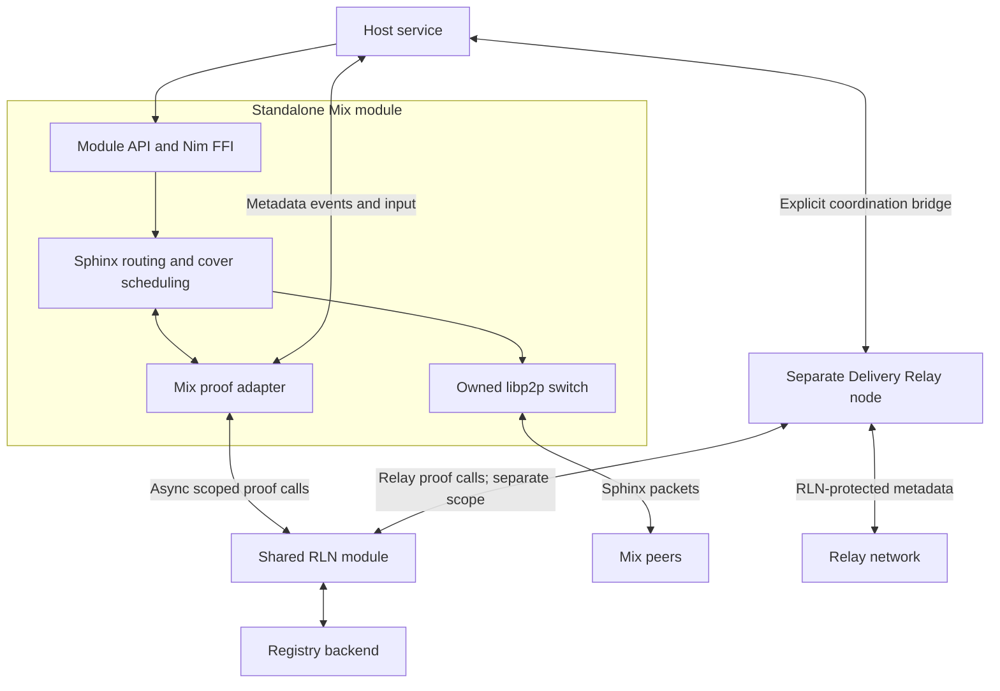
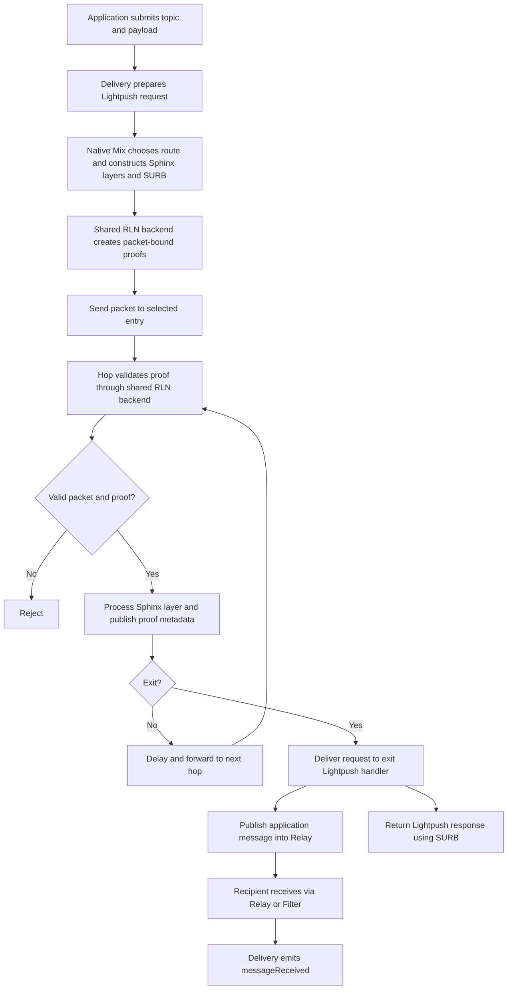

# logos-libp2p-mix-rln

A Logos Core module for standalone Mix intermediates. It owns a libp2p switch,
forwards Sphinx packets, and checks per-hop RLN proofs through the shared
`liblogos_rln_module`. Application sending and exit delivery are disabled by
default and require explicit opt-in.

The complete shared-RLN / native Delivery fixture has passed with fresh local
wallets and memberships, including the no-direct-fallback check. See
[WORK_SUMMARY.md](WORK_SUMMARY.md) for tested revisions and publication status.

## Architecture

### Responsibilities

| Component | Owns |
| --- | --- |
| This Logos module | Public API, configuration, FFI lifecycle, asynchronous calls to the RLN module, coordination events and queues. |
| `nim-libp2p-mix-ffi` | The standalone libp2p switch, Mix protocol, and proof adapter. |
| `nim-libp2p-mix` | Sphinx encryption and forwarding, route selection, delays, cover traffic, and single-use reply blocks (SURBs). |
| Mix RLN adapter | The existing Mix proof encoding, epoch checks, backend calls, and proof-metadata coordination. |
| `liblogos_rln_module` | Credentials, scoped membership, cryptographic proofs, verification, and durable message-id allocation. |
| Registry backend | Registry state and membership synchronization. The local test uses the LEZ registry module. |
| Native Delivery Mix | Application-side Mix sending and the Mix/Lightpush exit. Uses the same proof adapter as standalone intermediates. |
| Host application or service | Starts shared dependencies, supplies peer records, and bridges standalone coordination to Delivery. |



The standalone module does not require `logos-libp2p-module`: it creates its
own switch. It requires the shared RLN module. It does not require
Delivery as a module dependency, but a deployment must provide coordination.
The Logos Mixnet profile calls for RLN-protected Relay coordination; Delivery
is the integration used here. An arbitrary transport carrying the same bytes
is not sufficient evidence of conformance to that profile.

### Node roles

`mix.allowSend` and `mix.allowExit` are independent, create-time settings:

| allowSend | allowExit | Standalone application role |
| --- | --- | --- |
| false | false | Intermediate only; the default. |
| true | false | Sender and intermediate. |
| false | true | Exit and intermediate. |
| true | true | Sender, exit, and intermediate. |

Intermediate-only nodes still generate cover traffic and participate in
routing and proof coordination. These flags gate application endpoint APIs;
they do not turn off the protocol work needed by intermediates.

A Delivery **light client** uses Lightpush and Filter services without joining
the Relay mesh. A Mix **edge** is an application sender or exit. These are
different roles: a Delivery light
client beside an intermediate does not become a Mix edge merely by carrying
coordination. Delivery becomes a Mix edge when its native Mix support is
enabled and used for application sending or exit handling.

### Full sending-to-receiving path

Applications use Delivery's existing `send()` method. Configure its anonymity
level as `Required` and enable native Mix with the shared RLN backend.
`Required` must fail to deliver when a Mix route is unavailable; it must not
fall back to direct application Lightpush or Relay publication.

```mermaid
flowchart LR
    App[Sending application] -->|Delivery.send; Required| S[Delivery native Mix sender]
    S -->|Sphinx packet| I1[Standalone intermediate: entry hop]
    I1 -->|Next encrypted layer| I2[Standalone intermediate]
    I2 -->|Final encrypted layer| E[Delivery native Mix exit]
    E -->|Lightpush request handled at exit| R[Relay network]
    R -->|Relay or Filter| D[Recipient Delivery node]
    D -->|messageReceived| Receiver[Receiving application]
    E -.->|Lightpush response over SURB route| S
```



This is one possible three-hop forward route: the entry is the first selected
Mix intermediate, followed by another intermediate and an eligible exit.
The routing pool can contain more nodes than a single route uses. The network
fixture provides three standalone intermediates plus a sender and an exit,
so route selection and SURB return paths have enough candidates.



The recipient need not be a Mix node. The exit terminates Mix protection and
publishes into the ordinary Delivery network. Mix protects the route to the
exit; it does not provide application end-to-end encryption. Applications
that require payload confidentiality from the exit and Relay participants
must encrypt their own content. A Lightpush response confirms that operation,
not that the receiving application has consumed the message.

### Deployment used by the integration test

| Host | Mix traffic | Delivery traffic | RLN memberships |
| --- | --- | --- | --- |
| Sender | Native Delivery creates the route and receives the SURB response. | Light client sends through `send(Required)` and exchanges proof metadata. | Mix and Relay |
| Three intermediate hosts | Each standalone module forwards packets; application sending and exit handling stay disabled. | Each has a separate Delivery Relay node for proof metadata coordination. | Mix and Relay |
| Exit | Native Delivery handles the final Mix hop and returns a SURB response. | Lightpush service publishes the application message to Relay. | Mix and Relay |
| Relay service | None. | Relays messages and serves Filter subscriptions. | Relay |
| Recipient | None. | Receives the application payload through Filter. | Relay |

Each host owns one shared RLN backend and its own funded registry wallet. On
an intermediate host, both modules use that backend through different scopes.
The sender and exit use Delivery's native Mix switch; they do not load the
standalone Mix module. The recipient is a Delivery receiver, not a Mix exit.

### Two switches on an intermediate host

A host using Delivery for coordination has a standalone Mix switch and a
separate Delivery switch. They have different peer IDs, listeners, routing
pools, and lifecycles. `addMixPeer()` changes only the Mix pool. Starting Mix
does not start Delivery or subscribe it to metadata.

In this deployment, each intermediate's Delivery node joins the Relay mesh
and publishes and receives proof metadata directly. Sender and recipient
Delivery nodes remain light clients. Lightpush and Filter services run on the
exit and the separate Relay service node. The coordination node's anonymity
setting should not route proof metadata back through Mix: coordination must
remain available without depending on the Mix traffic it validates. Native
Delivery's adapter publishes its own metadata directly through Relay or
non-Mix Lightpush.
Native shared Mix rejects startup when Relay RLN is disabled.

## Shared RLN and coordination

All Mix participants must agree on registry ID, application scope, epoch
parameters, proof format, and metadata topic. The current profile targets
10-second epochs, rate limit 100, and accepted epoch gap 3. Root retention
belongs to the backend/registry; the specification calls for a window of 5.
The example scope and topic are integration values, not assigned deployment
identifiers.

This deployment provisions **separate RLN application scopes and memberships**
for Mix and Relay, even when they share one backend process. A Mix packet proof is bound to that hop's
serialized Sphinx packet. A Relay proof protects the Delivery message carrying
metadata. One is not a substitute for the other.

The adapter retains the existing 301-byte Mix proof encoding. That encoding
omits the external nullifier; the shared backend reconstructs it from the
requested scope and epoch, verifies the proof, and returns the value for
metadata tracking. Wrong scope, altered signal, missing fields, quota failures,
and backend errors fail closed. The current core uses 4,608-byte Sphinx packets
plus the proof; do not infer full wire-format conformance from profile defaults.

Membership allocation and synchronization are backend responsibilities. Shared
mode does not distribute the old off-chain membership announcements. The
adapter only exchanges proof metadata with other Mix participants.

### Coordination API contract

| API | Representation |
| --- | --- |
| `RlnPublishRequested` event | `{contentTopic, payload}` with raw bytes. |
| `drainCoordBacklog()` | Returns and clears `[{contentTopic, payloadHex}]`. |
| `deliverCoordFrame(contentTopic, payloadHex)` | Consumes received metadata; rejects unknown topics or malformed input. |

Choose events or polling for outgoing publication. Events also leave entries
in the backlog; an event-driven host should drain those entries without
publishing them again. Queues are in memory and do not acknowledge network
delivery. Preserve topic and payload exactly and handle transport failures in
the host. Successful event emission is not successful Relay publication.

Queue cross-module work outside the Mix callback. The public wrapper exposes
synchronous operations over an asynchronous FFI; re-entering it inside a
callback can block progress. Keep the coordination bridge running throughout
the node's lifetime, including when there are no application messages.

### Proof allocation, cancellation, and cover

The shared backend allocates message IDs durably. Cover precomputation prepares
Sphinx packets without consuming proof quota; proofs are requested when packets
are sent. Canceled or failed sends do not reclaim spent allocations. Shutdown
cancels pending adapter requests and ignores late replies.

Cover rate must be greater than zero and no greater than one. The default is
0.7; local tests use 0.01 to reduce cost. A low test rate is not a privacy or
capacity guarantee. Intermediate-only mode still sends cover packets.

## Startup and configuration

1. Load the registry and shared RLN modules. Initialize and fund the registry
   wallet as required by that registry implementation.
2. Start the shared backend with the required registries and matching epoch
   parameters. Provision separate Mix and Relay scopes and wait for active
   memberships. A registration submission can precede chain activation. Track
   its returned `membership_hash` in `get_memberships(registryId)` while pending;
   scope lookup can be ambiguous until a dedicated membership becomes active.
3. Start Delivery and subscribe to the metadata topic. When the host owns the
   backend lifecycle, select a Delivery RLN preset with `manage-backend=false`.
4. Call `createNode(configJson)` on this module, then `start()`.
5. Exchange peer records and install the standalone coordination bridge.
6. Keep backend, coordination, and routing available together. Stop Mix before
   stopping its shared backend; the host stops a shared backend only after all
   consumers have stopped.

The module constructor defers node creation until the host
and backend are available. Loading the module, or setting the configuration
environment variable, does not replace the explicit `createNode()` call.
`ok()` reports initialization errors, not network readiness or active membership.

[`config.example.json`](config.example.json) provides the standalone settings.
Replace its registry placeholder with the real registry ID:

```json
{
  "addrs": ["/ip4/0.0.0.0/tcp/9100"],
  "transport": "tcp",
  "mix": {"allowSend": false, "allowExit": false, "cover": {"rateFraction": 0.7}},
  "rln": {
    "registryId": "<registry-id>",
    "rlnIdentifierHex": "6d69782d726c6e2d7370616d2d70726f74656374696f6e2f7631000000000000",
    "epochDurationSeconds": 10,
    "maxEpochGap": 3,
    "userMessageLimit": 100,
    "proofMetadataContentTopic": "/mix/1/metadata/proto"
  }
}
```

`LIBP2P_MIX_RLN_MODULE_CONFIG` accepts inline JSON or a file path.
`createNode(configJson)` supplies explicit node configuration. Stop a running
node before replacing it. For QUIC use `transport: "quic"` and a QUIC listen
address such as `/ip4/0.0.0.0/udp/9100/quic-v1`.

Native Delivery Mix uses its own configuration fields:

```json
{
  "mix": true,
  "anonymityLevel": "Required",
  "mix-rln-registry-id": "<registry-id>",
  "mix-rln-identifier-hex": "6d69782d726c6e2d7370616d2d70726f74656374696f6e2f7631000000000000",
  "mix-rln-metadata-topic": "/mix/1/metadata/proto"
}
```

These fields supplement ordinary Delivery network and Relay-RLN configuration.
They do not configure service peers or provision credentials. The exit must
provide the Lightpush service and connect to the Relay network. Configure the
sender's Lightpush service peers to be Mix-capable exits: current Delivery peer
selection does not filter ordinary Lightpush peers by Mix capability. The standalone
coordination nodes should use ordinary Delivery sending for metadata.

### Peer records and discovery

Both standalone Mix and the updated Delivery module expose
`getLocalMixPeerRecord()` and `addMixPeer(recordJson)`. Exchange the complete
record: peer ID, multiaddresses, Mix public key, libp2p public key, and
no separate exit capability. Logos application sends name their destination as
the final Mix hop. All participants need usable peer pools.

Native Delivery waits for Identify before checking a registered Mix peer. A
standalone Mix-only peer does not need to implement Waku metadata; a peer that
advertises Waku metadata still undergoes the normal cluster check. Adding a
Mix record does not bypass that check for ordinary Delivery peers.

Discovery remains host-managed. This API does not implement Logos Service
Discovery or validate a peer's registry membership merely by adding its record.

### Public API

| Area | Methods |
| --- | --- |
| Lifecycle and health | `ok`, `status`, `createNode`, `start`, `stop` |
| Introspection | `getNodeInfo`, `getLocalMixPeerRecord`, `addMixPeer`, `listMixPeers` |
| Membership | `registerRlnMembership`, `hasRlnMembership` |
| Coordination | `deliverCoordFrame`, `drainCoordBacklog`; `RlnPublishRequested` event |
| Optional sender | `sendMixMessage`, `sendMixMessageWithSurb`, `sendMixSurbReply` |
| Optional exit | `mountReceiver`, `drainReceivedMessages`; `IncomingMixMessage` event |
| Cover | `getCoverTrafficRate`, `setCoverTrafficRate` |
| Diagnostics | `collectMetrics` currently returns an empty map. |

`getNodeInfo` accepts `Version`, `PeerId`, `Multiaddrs`, `MixPublicKey`, and
`RlnMembershipIndex`. Registration delegates to the backend using
`registrationOptionsJson`; callers must also observe membership activation.
For the LEZ registry, options can include `[{"key":"rate_limit","value":"100"}]`.

The module uses SDK worker dispatch for its synchronous methods. The host event
loop remains free to service asynchronous RLN calls; node operations are
serialized with a mutex. Blocking the host event loop would deadlock startup
and proof requests.

Standalone endpoint APIs remain available for compatibility and protocol tests.
They require the corresponding role opt-in. Mounting an application receiver
is unnecessary for an intermediate. Production Delivery application sending
uses native Delivery Mix rather than a host manually wrapping `sendMixMessage`.

## Build and validation

```sh
nix build .#lgx --no-write-lock-file
nix build .#unit-tests --no-write-lock-file
```

The unit target runs configuration tests, including default intermediate roles
and rejection of removed embedded-provider settings. Dependencies span multiple open PRs; consult
[WORK_SUMMARY.md](WORK_SUMMARY.md) before assuming all remote pins include the
latest local integration changes.

The new [shared Delivery network fixture](tests/integration_e2e/shared_delivery_mix)
uses the `logos-rln-e2e` local target for chain provisioning, wallet funding,
and module daemons. Supply built `MIX_LGX`, `DELIVERY_LGX`, `RLN_LGX`, and
`LEZ_RLN_LGX` files, plus `LOGOSCORE` and `RLN_E2E_ROOT`. Install the scenario
under that harness's `scenarios/shared-delivery-mix` directory and run:

```sh
"$RLN_E2E_ROOT/run.sh" shared-delivery-mix --target local
```

Its seven hosts provide sender, three standalone intermediates, native Mix
exit, Relay service, and recipient. It checks the exact received payload,
protected metadata exchange, and a negative case: stop Mix intermediates while
keeping Relay/Filter usable and verify that `Required` does not bypass Mix.
The complete fixture passed using the pinned bundles: seven fresh funded
wallets, active scoped memberships, protected metadata exchange, exact payload
delivery, and the no-direct-fallback check. Tested revisions and logs are
recorded in the work summary.

### Registry wallet compatibility

The root flake overrides the registry module's wallet dependency to upstream
LEZ commit `f0778a4316daa4065ff18a77f4f98706149c240e`, included in merged
[LEZ #884](https://github.com/logos-blockchain/logos-execution-zone/pull/884).
Earlier builds used a fee cap based on the default 2,000,000 gas limit even when
registration configured 10,000,000, so fresh provisioning failed as base fees
rose despite funded wallets. The upstream wallet scales the cap with the
configured limit; all 49 upstream wallet unit tests pass. The seven-host fixture
also passes with the upstream wallet; see the migration results in
[WORK_SUMMARY.md](WORK_SUMMARY.md).

A submitted membership is not necessarily active. If the registry rejects its
transaction, a retryable failure can leave it pending until the backend's
confirmation timeout. Calling registration again while it is pending returns
the existing record; it does not resubmit the transaction. Inspect the registry
and wallet logs when activation fails.

## Migration limits

The shared RLN module is the only proof backend. The provider selector, local
keystore/password/tree/resource settings, membership-announcement topic, and
`RlnMembershipRegistered` event have been removed. Old JSON settings are
rejected instead of silently selecting a different backend. Configure wallet
and credential storage on the registry/RLN modules, then query membership
activation through their APIs. Direct FFI consumers must rebuild against the
new generated C header.

Production work still includes deployment identifiers/topics, service discovery,
coordination delivery/recovery policy, complete specification conformance review,
and CI coverage of the local-chain integration. See the current
[Logos Mixnet specification](https://github.com/logos-co/logos-lips/pull/387)
and the work summary for scope and remaining validation.
